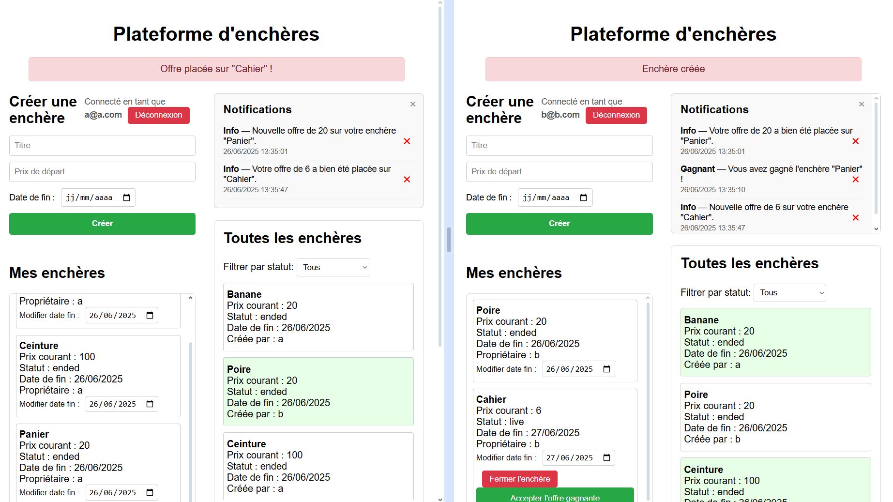

# Plateforme d’Enchères Microservices

## Description

Ce projet est une plateforme d’enchères en temps réel, conçue en architecture microservices.  
Chaque service est indépendant, communiquant via API REST sur des ports distincts.


Fonctionnalités principales :  
- Authentification JWT  
- Gestion utilisateurs  
- Création et gestion des enchères  
- Gestion des offres (bids)  
- Notifications en temps réel  
- Frontend React simple

---

## Structure des dossiers et ports

| Service                | Description                   | Port  |
|------------------------|------------------------------|-------|
| `auth-gateway`         | Authentification JWT          | 3000  |
| `user-service`         | Gestion utilisateurs          | 3001  |
| `auction-service`      | Gestion des enchères          | 3002  |
| `bid-service`          | Gestion des offres (bids)     | 3003  |
| `notification-service` | Gestion des notifications     | 3004  |
| `ui`                   | Frontend React                | 3005  |

---

## Installation & lancement

### Prérequis

- Node.js (version 16+ recommandée)  
- npm (gestionnaire de paquets)

### Étapes

Pour chaque dossier de service (`auth-gateway`, `user-service`, `auction-service`, `bid-service`, `notification-service`, `ui`), exécute :

```bash
cd nom_du_service
npm install
npm start
```

# Fonctionnalités & vérifications

## Authentification & utilisateurs
- Inscription d’un nouveau compte utilisateur
- Connexion / Déconnexion avec gestion du token JWT
- Gestion basique des données utilisateurs via API (CRUD)

## Enchères
- Création d’une enchère (titre, prix de départ, date de fin)
- Affichage des enchères (toutes et mes enchères)
- Modification de la date de fin d’une enchère créée par soi-même
- Fermeture manuelle d’une enchère (bouton “Fermer l’enchère”)

## Offres (bids)
- Placer une offre supérieure sur une enchère en cours (“live”)
- Interdiction d’enchérir sur sa propre enchère
- Notifications envoyées :
  - Au créateur de l’enchère à chaque nouvelle offre
  - À l’ancien meilleur enchérisseur lorsqu’il est surenchéri
  - À l’enchérisseur actuel pour confirmation

## Notifications
- Affichage des notifications dans l’interface utilisateur
- Suppression individuelle des notifications
- Notification “Victoire” envoyée quand une offre est acceptée par le propriétaire

## Acceptation de l’offre gagnante
- Bouton “Accepter l’offre” dans la liste “Mes enchères” pour une enchère fermée
- Envoi d’une notification “Victoire” au dernier enchérisseur lorsque l’offre est acceptée
- Une enchère fermée sans acceptation ne désigne pas de gagnant

## Notes techniques
- Les services communiquent entre eux via HTTP sur localhost et les ports indiqués
- Les données sont stockées en mémoire (pas de persistance sur disque)
- Le JWT utilise une clé secrète simple (variable SECRET_KEY)
- Le frontend React utilise la fetch API pour les appels réseau



